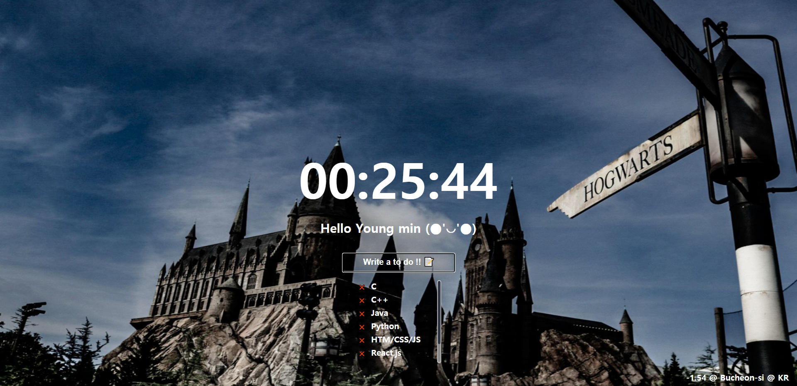

# Momentom CloneCoding by JavaScript 

## 📝 Function

    - To Do List
    - Clock
    - Weather with Geolocation
    - Clone of the Momentum App

## 📝 Result

## 📝caution

### location-based builds may not work due to security issues. 😂

> Test Link : http://wi.kdt-gitlab.elice.io/clonecoding_momentom 
